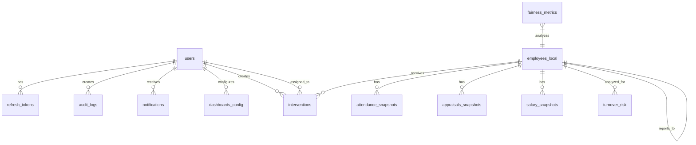

# 🏗️ Smart HR System - Architecture Documentation

## 📋 جدول المحتويات
1. [نظرة عامة](#نظرة-عامة)
2. [معمارية النظام](#معمارية-النظام)
3. [مكدس التقنيات](#مكدس-التقنيات)
4. [بنية البيانات](#بنية-البيانات)
5. [معمارية API](#معمارية-api)
6. [معمارية الأمان](#معمارية-الأمان)
7. [معمارية التوسع](#معمارية-التوسع)
8. [معمارية النشر](#معمارية-النشر)
9. [معمارية المراقبة](#معمارية-المراقبة)

---

## 🎯 نظرة عامة

### المفهوم الأساسي
نظام Smart HR هو منصة شاملة مدعومة بالذكاء الاصطناعي لإدارة وتحليل أداء الموارد البشرية. يجمع النظام بين تقنيات حديثة في واجهات المستخدم، واجهات برمجة التطبيقات، وتحليل البيانات لتمكين المؤسسات من اتخاذ قرارات مدعومة بالبيانات.

### الأهداف الرئيسية
1. **تحليل مخاطر دوران الموظفين** باستخدام نماذج ML
2. **تقييم العدالة الوظيفية** عبر تحليل الفجوات
3. **توليد توصيات ذكية** للتدخلات الاستباقية
4. **إنشاء تقارير تحليلية** شاملة
5. **التكامل مع ERPNext** لنظام موحد

### الجمهور المستهدف
- مسؤولو الموارد البشرية
- المديرون التنفيذيون
- محللو البيانات
- مدراء الأقسام
- الموظفون (واجهة محدودة)

---

## 🏗️ معمارية النظام

### الرسم المعماري الكامل
```

┌─────────────────────────────────────────────────────────────────────────┐
│                          NGINX Reverse Proxy                             │
│                     (Load Balancer + SSL Termination)                    │
│                                                                          │
│  ┌─────────────────┐  ┌─────────────────┐  ┌─────────────────┐         │
│  │   Frontend      │  │   Backend API   │  │   ML Service    │         │
│  │   React App     │  │   NestJS        │  │   FastAPI       │         │
│  │   Port: 3001    │  │   Port: 3000    │  │   Port: 8000    │         │
│  └─────────────────┘  └─────────────────┘  └─────────────────┘         │
│                                                                          │
│  ┌─────────────────────────────────────────────────────────────────┐    │
│  │                     PostgreSQL Database                          │    │
│  │                     Port: 5432                                  │    │
│  └─────────────────────────────────────────────────────────────────┘    │
│                                                                          │
│  ┌─────────────────┐  ┌─────────────────┐  ┌─────────────────┐         │
│  │   Redis Cache   │  │   Prometheus    │  │   Grafana       │         │
│  │   Port: 6379    │  │   Port: 9090    │  │   Port: 3002    │         │
│  └─────────────────┘  └─────────────────┘  └─────────────────┘         │
└─────────────────────────────────────────────────────────────────────────┘

```

### تدفق البيانات
```

┌─────────┐    ┌─────────┐    ┌─────────┐    ┌─────────┐    ┌─────────┐
│ ERPNext │───▶│ Backend │───▶│   DB    │───▶│   ML    │───▶│Frontend │
└─────────┘    └─────────┘    └─────────┘    └─────────┘    └─────────┘
│              │              │              │              │
└──────────────┴──────────────┴──────────────┴──────────────┘
│
┌─────────┐
│Reports  │
└─────────┘

```

### طبقات النظام

#### **الطبقة 1: Presentation Layer (واجهة المستخدم)**
- **التكنولوجيا:** React 19 + TypeScript
- **الوظائف:** عرض البيانات، تفاعل المستخدم، توليد التقارير
- **المكونات:** صفحات، مكونات، charts، forms
- **الاتصال:** REST API + WebSocket للبيانات الحية

#### **الطبقة 2: Application Layer (المنطق التطبيقي)**
- **التكنولوجيا:** NestJS (Node.js)
- **الوظائف:** معالجة الطلبات، تنفيذ الأعمال، المصادقة
- **المكونات:** Controllers، Services، Middleware، Guards
- **الاتصال:** HTTP/REST، gRPC (اختياري)، Message Queue

#### **الطبقة 3: Business Logic Layer (منطق الأعمال)**
- **التكنولوجيا:** TypeScript + Python
- **الوظائف:** قواعد الأعمال، التحقق، التنسيق
- **المكونات:** Domain Models، Business Rules، Validation
- **الاتصال:** داخلي بين Services

#### **الطبقة 4: Data Access Layer (وصول البيانات)**
- **التكنولوجيا:** PostgreSQL + Drizzle ORM
- **الوظائف:** تخزين البيانات، استرجاعها، معالجتها
- **المكونات:** Entities، Repositories، Migrations
- **الاتصال:** Database connection pool

#### **الطبقة 5: External Services Layer (الخدمات الخارجية)**
- **التكنولوجيا:** FastAPI + Python
- **الوظائف:** نماذج ML، تحليل البيانات، تكاملات خارجية
- **المكونات:** ML Models، External APIs، Workers
- **الاتصال:** HTTP، WebSocket، Queue

---

## 🔧 مكدس التقنيات

### Frontend Stack
```yaml
Framework: React 19.0.0
Language: TypeScript 5.3.3
Build Tool: Vite 5.0.0
Styling: Tailwind CSS 4.0.0 + shadcn/ui
State Management: tRPC + React Context
Routing: React Router 6.20.0
Charts: Recharts 2.10.0
Forms: React Hook Form 7.48.0
Tables: TanStack Table 8.10.0
Icons: Lucide React 0.309.0
Testing: Vitest 1.0.0 + React Testing Library
```

Backend Stack

```yaml
Framework: NestJS 10.2.10
Language: TypeScript 5.3.3
Database: PostgreSQL 16.0 + Drizzle ORM 0.28.6
Authentication: Passport + JWT + bcrypt
API: REST + tRPC + Swagger/OpenAPI
Validation: class-validator + class-transformer
Caching: Redis 7.0 + cache-manager
Logging: Winston + Pino
Testing: Jest 29.7.0 + Supertest
Documentation: Compodoc + Swagger UI
```

ML Service Stack

```yaml
Framework: FastAPI 0.104.1
Language: Python 3.11.0
ML Libraries: scikit-learn 1.3.2, pandas 2.1.3, numpy 1.26.2
ML Models: XGBoost 2.0.0, LightGBM 4.1.0
Data Processing: Pandas, NumPy, Polars
Visualization: Matplotlib 3.8.2, Plotly 5.18.0
API Documentation: Swagger UI + Redoc
Testing: pytest 7.4.3, pytest-asyncio
```

Infrastructure Stack

```yaml
Containerization: Docker 24.0 + Docker Compose 2.20
Orchestration: Kubernetes 1.28 (للإنتاج)
Reverse Proxy: NGINX 1.24 + OpenSSL 3.0
CI/CD: GitHub Actions + ArgoCD
Monitoring: Prometheus 2.47 + Grafana 10.1.0
Logging: Loki 2.9.0 + Grafana Loki
Alerting: Alertmanager 0.25.0
Database: PostgreSQL 16.0 + PgBouncer
Caching: Redis 7.0 + Redis Sentinel
```

DevOps Tools

```yaml
Version Control: Git + GitHub
Container Registry: Docker Hub / GitHub Container Registry
Secret Management: HashiCorp Vault / Kubernetes Secrets
Configuration: Helm Charts + Kustomize
Infrastructure as Code: Terraform 1.6.0
Security Scanning: Trivy + Snyk
Performance Testing: k6 0.48.0
```

---

🗄️ بنية البيانات

مخطط قاعدة البيانات الكامل

1. الجداول الأساسية (Core Tables)

```sql
-- المستخدمون (النظام)
CREATE TABLE users (
    id UUID PRIMARY KEY DEFAULT uuid_generate_v4(),
    email VARCHAR(255) UNIQUE NOT NULL,
    username VARCHAR(100) UNIQUE NOT NULL,
    password_hash VARCHAR(255) NOT NULL,
    full_name VARCHAR(255) NOT NULL,
    role VARCHAR(50) NOT NULL CHECK (role IN ('admin', 'hr_manager', 'analyst', 'manager', 'employee', 'viewer')),
    department VARCHAR(100),
    designation VARCHAR(100),
    avatar_url TEXT,
    phone VARCHAR(20),
    is_active BOOLEAN DEFAULT TRUE,
    is_locked BOOLEAN DEFAULT FALSE,
    failed_login_attempts INTEGER DEFAULT 0,
    last_login_at TIMESTAMP,
    password_changed_at TIMESTAMP DEFAULT CURRENT_TIMESTAMP,
    created_at TIMESTAMP DEFAULT CURRENT_TIMESTAMP,
    updated_at TIMESTAMP DEFAULT CURRENT_TIMESTAMP,
    deleted_at TIMESTAMP,
    created_by UUID REFERENCES users(id),
    updated_by UUID REFERENCES users(id),
    
    -- Indexes
    INDEX idx_users_email (email),
    INDEX idx_users_role (role),
    INDEX idx_users_is_active (is_active),
    INDEX idx_users_department (department)
);

-- Refresh Tokens لإدارة الجلسات
CREATE TABLE refresh_tokens (
    id UUID PRIMARY KEY DEFAULT uuid_generate_v4(),
    user_id UUID NOT NULL REFERENCES users(id) ON DELETE CASCADE,
    token VARCHAR(512) UNIQUE NOT NULL,
    expires_at TIMESTAMP NOT NULL,
    created_at TIMESTAMP DEFAULT CURRENT_TIMESTAMP,
    revoked_at TIMESTAMP,
    replaced_by_token VARCHAR(512),
    ip_address INET,
    user_agent TEXT,
    
    -- Indexes
    INDEX idx_refresh_tokens_token (token),
    INDEX idx_refresh_tokens_user_id (user_id),
    INDEX idx_refresh_tokens_expires_at (expires_at)
);
```

2. جداول بيانات الموظفين (Employee Data)

```sql
-- الموظفون المحليون (من ERPNext)
CREATE TABLE employees_local (
    id UUID PRIMARY KEY DEFAULT uuid_generate_v4(),
    erpnext_id VARCHAR(100) UNIQUE NOT NULL,
    employee_code VARCHAR(50) UNIQUE NOT NULL,
    full_name VARCHAR(255) NOT NULL,
    first_name VARCHAR(100),
    last_name VARCHAR(100),
    email VARCHAR(255) UNIQUE NOT NULL,
    phone VARCHAR(50),
    department VARCHAR(100) NOT NULL,
    designation VARCHAR(100) NOT NULL,
    manager_id UUID REFERENCES employees_local(id),
    date_of_joining DATE NOT NULL,
    date_of_birth DATE,
    gender VARCHAR(20) CHECK (gender IN ('male', 'female', 'other', 'prefer_not_to_say')),
    marital_status VARCHAR(20),
    employment_type VARCHAR(50) CHECK (employment_type IN ('permanent', 'contract', 'intern', 'temporary')),
    employment_status VARCHAR(50) DEFAULT 'active' CHECK (employment_status IN ('active', 'inactive', 'suspended', 'terminated')),
    salary DECIMAL(12,2),
    cost_center VARCHAR(100),
    location VARCHAR(100),
    work_location VARCHAR(100),
    employment_grade VARCHAR(50),
    reporting_manager VARCHAR(255),
    bank_account_number VARCHAR(50),
    ifsc_code VARCHAR(20),
    pan_number VARCHAR(20),
    aadhaar_number VARCHAR(20),
    created_at TIMESTAMP DEFAULT CURRENT_TIMESTAMP,
    updated_at TIMESTAMP DEFAULT CURRENT_TIMESTAMP,
    last_sync_at TIMESTAMP,
    sync_status VARCHAR(20) DEFAULT 'pending' CHECK (sync_status IN ('pending', 'synced', 'failed', 'out_of_sync')),
    sync_error TEXT,
    
    -- Indexes
    INDEX idx_employees_erpnext_id (erpnext_id),
    INDEX idx_employees_department (department),
    INDEX idx_employees_status (employment_status),
    INDEX idx_employees_manager (manager_id),
    INDEX idx_employees_created_at (created_at)
);

-- سجلات الحضور
CREATE TABLE attendance_snapshots (
    id UUID PRIMARY KEY DEFAULT uuid_generate_v4(),
    employee_id UUID NOT NULL REFERENCES employees_local(id) ON DELETE CASCADE,
    attendance_date DATE NOT NULL,
    status VARCHAR(50) NOT NULL CHECK (status IN ('present', 'absent', 'half_day', 'work_from_home', 'leave', 'holiday')),
    check_in_time TIMESTAMP,
    check_out_time TIMESTAMP,
    working_hours DECIMAL(5,2),
    overtime_hours DECIMAL(5,2),
    late_minutes INTEGER DEFAULT 0,
    early_departure_minutes INTEGER DEFAULT 0,
    leave_type VARCHAR(50),
    leave_duration DECIMAL(3,1),
    remarks TEXT,
    approved_by UUID REFERENCES users(id),
    approval_status VARCHAR(20) DEFAULT 'pending' CHECK (approval_status IN ('pending', 'approved', 'rejected')),
    created_at TIMESTAMP DEFAULT CURRENT_TIMESTAMP,
    updated_at TIMESTAMP DEFAULT CURRENT_TIMESTAMP,
    
    -- Constraints
    UNIQUE(employee_id, attendance_date),
    
    -- Indexes
    INDEX idx_attendance_employee_date (employee_id, attendance_date),
    INDEX idx_attendance_date (attendance_date),
    INDEX idx_attendance_status (status),
    INDEX idx_attendance_approval (approval_status)
);

-- تقييمات الأداء
CREATE TABLE appraisals_snapshots (
    id UUID PRIMARY KEY DEFAULT uuid_generate_v4(),
    employee_id UUID NOT NULL REFERENCES employees_local(id) ON DELETE CASCADE,
    appraisal_date DATE NOT NULL,
    appraisal_period VARCHAR(50) NOT NULL,
    appraisal_type VARCHAR(50) CHECK (appraisal_type IN ('annual', 'probation', 'promotion', 'special')),
    rating DECIMAL(3,2) CHECK (rating >= 1.0 AND rating <= 5.0),
    reviewer_id UUID REFERENCES employees_local(id),
    reviewer_comments TEXT,
    employee_comments TEXT,
    strengths TEXT,
    areas_for_improvement TEXT,
    goals_achieved TEXT,
    next_period_goals TEXT,
    training_needs TEXT,
    promotion_recommendation BOOLEAN DEFAULT FALSE,
    salary_increment_recommendation DECIMAL(5,2),
    overall_score DECIMAL(5,2),
    status VARCHAR(20) DEFAULT 'draft' CHECK (status IN ('draft', 'submitted', 'reviewed', 'approved', 'rejected')),
    created_at TIMESTAMP DEFAULT CURRENT_TIMESTAMP,
    updated_at TIMESTAMP DEFAULT CURRENT_TIMESTAMP,
    
    -- Indexes
    INDEX idx_appraisals_employee_date (employee_id, appraisal_date),
    INDEX idx_appraisals_rating (rating),
    INDEX idx_appraisals_status (status),
    INDEX idx_appraisals_period (appraisal_period)
);

-- سجلات الرواتب
CREATE TABLE salary_snapshots (
    id UUID PRIMARY KEY DEFAULT uuid_generate_v4(),
    employee_id UUID NOT NULL REFERENCES employees_local(id) ON DELETE CASCADE,
    salary_month DATE NOT NULL,
    salary_structure VARCHAR(100),
    basic_salary DECIMAL(12,2) NOT NULL,
    house_rent_allowance DECIMAL(12,2) DEFAULT 0,
    conveyance_allowance DECIMAL(12,2) DEFAULT 0,
    medical_allowance DECIMAL(12,2) DEFAULT 0,
    special_allowance DECIMAL(12,2) DEFAULT 0,
    other_allowances DECIMAL(12,2) DEFAULT 0,
    total_allowances DECIMAL(12,2) GENERATED ALWAYS AS (
        COALESCE(house_rent_allowance, 0) +
        COALESCE(conveyance_allowance, 0) +
        COALESCE(medical_allowance, 0) +
        COALESCE(special_allowance, 0) +
        COALESCE(other_allowances, 0)
    ) STORED,
    professional_tax DECIMAL(12,2) DEFAULT 0,
    provident_fund DECIMAL(12,2) DEFAULT 0,
    income_tax DECIMAL(12,2) DEFAULT 0,
    other_deductions DECIMAL(12,2) DEFAULT 0,
    total_deductions DECIMAL(12,2) GENERATED ALWAYS AS (
        COALESCE(professional_tax, 0) +
        COALESCE(provident_fund, 0) +
        COALESCE(income_tax, 0) +
        COALESCE(other_deductions, 0)
    ) STORED,
    net_salary DECIMAL(12,2) GENERATED ALWAYS AS (
        basic_salary + total_allowances - total_deductions
    ) STORED,
    bonus DECIMAL(12,2) DEFAULT 0,
    overtime_pay DECIMAL(12,2) DEFAULT 0,
    incentives DECIMAL(12,2) DEFAULT 0,
    total_earnings DECIMAL(12,2) GENERATED ALWAYS AS (
        net_salary + COALESCE(bonus, 0) + COALESCE(overtime_pay, 0) + COALESCE(incentives, 0)
    ) STORED,
    payment_date DATE,
    payment_status VARCHAR(50) DEFAULT 'pending' CHECK (payment_status IN ('pending', 'processed', 'paid', 'failed')),
    payment_reference VARCHAR(100),
    remarks TEXT,
    created_at TIMESTAMP DEFAULT CURRENT_TIMESTAMP,
    updated_at TIMESTAMP DEFAULT CURRENT_TIMESTAMP,
    
    -- Constraints
    UNIQUE(employee_id, salary_month),
    CHECK (net_salary >= 0),
    
    -- Indexes
    INDEX idx_salary_employee_month (employee_id, salary_month),
    INDEX idx_salary_month (salary_month),
    INDEX idx_salary_payment_status (payment_status)
);
```

3. جداول التحليلات الذكية (Analytics Tables)

```sql
-- مخاطر دوران الموظفين
CREATE TABLE turnover_risk (
    id UUID PRIMARY KEY DEFAULT uuid_generate_v4(),
    employee_id UUID NOT NULL REFERENCES employees_local(id) ON DELETE CASCADE,
    risk_score DECIMAL(5,4) NOT NULL CHECK (risk_score >= 0 AND risk_score <= 1),
    risk_level VARCHAR(20) NOT NULL CHECK (risk_level IN ('low', 'medium', 'high', 'critical')),
    confidence_score DECIMAL(5,4) CHECK (confidence_score >= 0 AND confidence_score <= 1),
    contributing_factors JSONB NOT NULL DEFAULT '[]',
    predicted_turnover_date DATE,
    retention_probability DECIMAL(5,4),
    recommended_actions JSONB DEFAULT '[]',
    last_prediction_date TIMESTAMP DEFAULT CURRENT_TIMESTAMP,
    prediction_valid_until TIMESTAMP,
    ml_model_version VARCHAR(50),
    model_features JSONB,
    prediction_metadata JSONB,
    created_at TIMESTAMP DEFAULT CURRENT_TIMESTAMP,
    updated_at TIMESTAMP DEFAULT CURRENT_TIMESTAMP,
    
    -- Indexes
    INDEX idx_turnover_risk_score (risk_score),
    INDEX idx_turnover_risk_level (risk_level),
    INDEX idx_turnover_risk_employee (employee_id),
    INDEX idx_turnover_risk_date (last_prediction_date)
);

-- مؤشرات العدالة
CREATE TABLE fairness_metrics (
    id UUID PRIMARY KEY DEFAULT uuid_generate_v4(),
    metric_name VARCHAR(100) NOT NULL,
    category VARCHAR(50) NOT NULL CHECK (category IN ('gender', 'age', 'department', 'designation', 'tenure', 'education')),
    subcategory VARCHAR(100),
    value DECIMAL(10,4) NOT NULL,
    threshold DECIMAL(10,4) NOT NULL,
    status VARCHAR(20) NOT NULL CHECK (status IN ('acceptable', 'warning', 'critical', 'excellent')),
    analysis_date DATE NOT NULL,
    department VARCHAR(100),
    sample_size INTEGER NOT NULL,
    confidence_interval_lower DECIMAL(10,4),
    confidence_interval_upper DECIMAL(10,4),
    p_value DECIMAL(10,6),
    is_statistically_significant BOOLEAN,
    recommendations JSONB DEFAULT '[]',
    insights TEXT,
    created_at TIMESTAMP DEFAULT CURRENT_TIMESTAMP,
    
    -- Indexes
    INDEX idx_fairness_metric_name (metric_name),
    INDEX idx_fairness_category (category),
    INDEX idx_fairness_date (analysis_date),
    INDEX idx_fairness_status (status)
);

-- التدخلات والتوصيات
CREATE TABLE interventions (
    id UUID PRIMARY KEY DEFAULT uuid_generate_v4(),
    employee_id UUID NOT NULL REFERENCES employees_local(id) ON DELETE CASCADE,
    intervention_type VARCHAR(100) NOT NULL CHECK (intervention_type IN (
        'salary_increase', 'promotion', 'training', 'mentoring', 
        'role_change', 'workload_adjustment', 'recognition', 'benefits_enhancement'
    )),
    title VARCHAR(255) NOT NULL,
    description TEXT,
    rationale TEXT,
    status VARCHAR(50) DEFAULT 'pending' CHECK (status IN (
        'pending', 'approved', 'rejected', 'in_progress', 'completed', 'cancelled'
    )),
    priority VARCHAR(20) CHECK (priority IN ('low', 'medium', 'high', 'critical')),
    assigned_to UUID REFERENCES users(id),
    assigned_by UUID REFERENCES users(id),
    start_date DATE,
    end_date DATE,
    actual_start_date DATE,
    actual_end_date DATE,
    estimated_cost DECIMAL(12,2),
    actual_cost DECIMAL(12,2),
    budget_approved BOOLEAN DEFAULT FALSE,
    expected_impact JSONB,
    actual_impact JSONB,
    success_criteria TEXT,
    outcome TEXT,
    outcome_rating INTEGER CHECK (outcome_rating >= 1 AND outcome_rating <= 5),
    lessons_learned TEXT,
    follow_up_required BOOLEAN DEFAULT FALSE,
    follow_up_date DATE,
    created_by UUID REFERENCES users(id),
    updated_by UUID REFERENCES users(id),
    created_at TIMESTAMP DEFAULT CURRENT_TIMESTAMP,
    updated_at TIMESTAMP DEFAULT CURRENT_TIMESTAMP,
    
    -- Indexes
    INDEX idx_interventions_employee (employee_id),
    INDEX idx_interventions_status (status),
    INDEX idx_interventions_type (intervention_type),
    INDEX idx_interventions_priority (priority),
    INDEX idx_interventions_assigned (assigned_to)
);
```

4. جداول النظام (System Tables)

```sql
-- الإشعارات
CREATE TABLE notifications (
    id UUID PRIMARY KEY DEFAULT uuid_generate_v4(),
    user_id UUID NOT NULL REFERENCES users(id) ON DELETE CASCADE,
    type VARCHAR(50) NOT NULL CHECK (type IN (
        'info', 'warning', 'error', 'success', 
        'turnover_alert', 'fairness_alert', 'intervention_alert',
        'system', 'announcement', 'reminder'
    )),
    title VARCHAR(255) NOT NULL,
    message TEXT NOT NULL,
    data JSONB,
    is_read BOOLEAN DEFAULT FALSE,
    read_at TIMESTAMP,
    action_url VARCHAR(500),
    action_label VARCHAR(100),
    priority VARCHAR(20) DEFAULT 'normal' CHECK (priority IN ('low', 'normal', 'high', 'critical')),
    category VARCHAR(50),
    created_by UUID REFERENCES users(id),
    created_at TIMESTAMP DEFAULT CURRENT_TIMESTAMP,
    expires_at TIMESTAMP,
    
    -- Indexes
    INDEX idx_notifications_user (user_id),
    INDEX idx_notifications_read (is_read),
    INDEX idx_notifications_created (created_at),
    INDEX idx_notifications_type (type),
    INDEX idx_notifications_priority (priority)
);

-- سجلات التدقيق
CREATE TABLE audit_logs (
    id UUID PRIMARY KEY DEFAULT uuid_generate_v4(),
    user_id UUID REFERENCES users(id),
    action VARCHAR(100) NOT NULL,
    entity_type VARCHAR(100),
    entity_id UUID,
    entity_name VARCHAR(255),
    old_values JSONB,
    new_values JSONB,
    changes JSONB,
    ip_address INET,
    user_agent TEXT,
    request_url VARCHAR(500),
    request_method VARCHAR(10),
    request_body TEXT,
    response_status INTEGER,
    response_time_ms INTEGER,
    error_message TEXT,
    stack_trace TEXT,
    severity VARCHAR(20) DEFAULT 'info' CHECK (severity IN ('debug', 'info', 'warning', 'error', 'critical')),
    tags JSONB,
    created_at TIMESTAMP DEFAULT CURRENT_TIMESTAMP,
    
    -- Indexes
    INDEX idx_audit_logs_user (user_id),
    INDEX idx_audit_logs_action (action),
    INDEX idx_audit_logs_entity (entity_type, entity_id),
    INDEX idx_audit_logs_created (created_at),
    INDEX idx_audit_logs_severity (severity)
);

-- تكوينات لوحات المعلومات
CREATE TABLE dashboards_config (
    id UUID PRIMARY KEY DEFAULT uuid_generate_v4(),
    user_id UUID NOT NULL REFERENCES users(id) ON DELETE CASCADE,
    dashboard_type VARCHAR(50) NOT NULL CHECK (dashboard_type IN (
        'executive', 'hr_manager', 'analyst', 'department_manager', 'employee'
    )),
    name VARCHAR(255) NOT NULL,
    description TEXT,
    config JSONB NOT NULL,
    is_default BOOLEAN DEFAULT FALSE,
    is_shared BOOLEAN DEFAULT FALSE,
    shared_with JSONB DEFAULT '[]',
    created_at TIMESTAMP DEFAULT CURRENT_TIMESTAMP,
    updated_at TIMESTAMP DEFAULT CURRENT_TIMESTAMP,
    
    -- Constraints
    UNIQUE(user_id, name),
    
    -- Indexes
    INDEX idx_dashboards_user (user_id),
    INDEX idx_dashboards_type (dashboard_type),
    INDEX idx_dashboards_default (is_default)
);

-- جدول إصدارات قاعدة البيانات
CREATE TABLE database_version (
    version VARCHAR(50) PRIMARY KEY,
    applied_at TIMESTAMP DEFAULT CURRENT_TIMESTAMP,
    description TEXT NOT NULL,
    checksum VARCHAR(64),
    execution_time_ms INTEGER,
    success BOOLEAN DEFAULT TRUE,
    error_message TEXT
);
```

العلاقات بين الجداول



استراتيجية الفهرسة

```sql
-- الفهرس المركب للاستعلامات الشائعة
CREATE INDEX idx_employee_analytics ON employees_local 
    USING btree(department, employment_status, date_of_joining DESC);

-- الفهرس الجزئي للبيانات النشطة فقط
CREATE INDEX idx_active_employees ON employees_local(employment_status) 
    WHERE employment_status = 'active';

-- الفهرس للتغطية (Covering Index)
CREATE INDEX idx_turnover_analysis ON turnover_risk 
    (risk_level, risk_score DESC) 
    INCLUDE (employee_id, last_prediction_date);

-- الفهرس للتسلسل الزمني
CREATE INDEX idx_time_series_attendance ON attendance_snapshots 
    USING brin(attendance_date);

-- الفهرس للبيانات الجغرافية
CREATE INDEX idx_employee_location ON employees_local 
    USING gist(location);
```

استراتيجية التقسيم (Partitioning)

```sql
-- تقسيم جداول الوقت (Time-based Partitioning)
CREATE TABLE attendance_snapshots_2024 
    PARTITION OF attendance_snapshots
    FOR VALUES FROM ('2024-01-01') TO ('2025-01-01');

CREATE TABLE salary_snapshots_2024 
    PARTITION OF salary_snapshots
    FOR VALUES FROM ('2024-01-01') TO ('2025-01-01');

-- تقسيم حسب القسم (Range Partitioning)
CREATE TABLE employees_engineering 
    PARTITION OF employees_local
    FOR VALUES IN ('Engineering', 'IT', 'Development');

CREATE TABLE employees_sales 
    PARTITION OF employees_local
    FOR VALUES IN ('Sales', 'Marketing', 'Business Development');
```

---

🌐 معمارية API

نمط API

```
RESTful API (JSON) + tRPC (للكفاءة) + WebSocket (للبيانات الحية)
```

هيكل API

```
/api
├── /auth          🔐 المصادقة والتفويض
├── /users         👥 إدارة المستخدمين
├── /employees     👨‍💼 بيانات الموظفين
├── /attendance    📅 الحضور والانصراف
├── /appraisals    📊 تقييمات الأداء
├── /salaries      💰 بيانات الرواتب
├── /turnover-risk ⚠️ مخاطر الدوران
├── /fairness      ⚖️ تحليل العدالة
├── /interventions 🛠️ التدخلات والتوصيات
├── /reports       📄 التقارير
├── /analytics     📈 التحليلات
├── /notifications 🔔 الإشعارات
├── /audit         📝 سجلات التدقيق
└── /system        ⚙️ إعدادات النظام
```

أمثلة على Endpoints

Auth Module

```http
POST   /api/auth/login              # تسجيل الدخول
POST   /api/auth/register           # تسجيل مستخدم جديد
POST   /api/auth/logout             # تسجيل الخروج
POST   /api/auth/refresh            # تجديد الـ Token
GET    /api/auth/me                 # بيانات المستخدم الحالي
POST   /api/auth/change-password    # تغيير كلمة المرور
POST   /api/auth/forgot-password    # نسيت كلمة المرور
POST   /api/auth/reset-password     # إعادة تعيين كلمة المرور
POST   /api/auth/verify-email       # التحقق من البريد الإلكتروني
```

Employees Module

```http
GET    /api/employees               # قائمة جميع الموظفين
GET    /api/employees/{id}          # بيانات موظف محدد
POST   /api/employees               # إضافة موظف جديد
PUT    /api/employees/{id}          # تحديث بيانات موظف
DELETE /api/employees/{id}          # حذف موظف
GET    /api/employees/search        # بحث في الموظفين
GET    /api/employees/filter        # تصفية الموظفين
GET    /api/employees/export        # تصدير بيانات الموظفين
POST   /api/employees/import        # استيراد بيانات الموظفين
GET    /api/employees/departments   # قائمة الأقسام
GET    /api/employees/designations  # قائمة المسميات الوظيفية
```

Turnover Risk Module

```http
GET    /api/turnover-risk           # قائمة مخاطر الدوران
GET    /api/turnover-risk/{id}      # مخاطر موظف محدد
POST   /api/turnover-risk/predict   # تنبؤ جديد للمخاطر
GET    /api/turnover-risk/high-risk # الموظفون ذوو المخاطر العالية
GET    /api/turnover-risk/trends    # اتجاهات المخاطر
GET    /api/turnover-risk/factors   # عوامل المخاطر
POST   /api/turnover-risk/train     # تدريب النموذج
GET    /api/turnover-risk/metrics   # مقاييس أداء النموذج
GET    /api/turnover-risk/report    # تقرير مخاطر الدوران
```

نمط الاستجابة

```json
{
  "success": true,
  "data": {
    // البيانات الرئيسية
  },
  "meta": {
    "page": 1,
    "limit": 50,
    "total": 1000,
    "totalPages": 20
  },
  "links": {
    "self": "/api/employees?page=1",
    "next": "/api/employees?page=2",
    "prev": null,
    "first": "/api/employees?page=1",
    "last": "/api/employees?page=20"
  },
  "timestamp": "2024-01-15T10:30:00Z",
  "version": "1.0.0"
}
```

نمط الخطأ

```json
{
  "success": false,
  "error": {
    "code": "VALIDATION_ERROR",
    "message": "Invalid input data",
    "details": [
      {
        "field": "email",
        "message": "Email must be a valid email address"
      }
    ],
    "timestamp": "2024-01-15T10:30:00Z",
    "requestId": "req_123456789"
  }
}
```

---

🔐 معمارية الأمان

طبقات الأمان

```
1. Network Security (شبكة)
2. Application Security (تطبيق)
3. Data Security (بيانات)
4. Access Control (التحكم بالوصول)
```

Network Security

```yaml
# جدار الحماية (Firewall)
- Allow: 80, 443 (HTTP/HTTPS)
- Allow: 3000-3002 (Application Ports)
- Allow: 5432 (PostgreSQL - Internal Only)
- Deny: All Other Ports

# DDoS Protection
- Rate Limiting: 1000 requests/minute per IP
- IP Whitelisting: للواجهات الإدارية
- Geo-blocking: حسب الحاجة

# VPN Access
- Admin Access: عبر VPN فقط
- Database Access: عبر Jump Server
```

```

## [استمرار الملف... سأقوم بإرسال الملفات الأربعة كاملة في عدة ردود]
```
