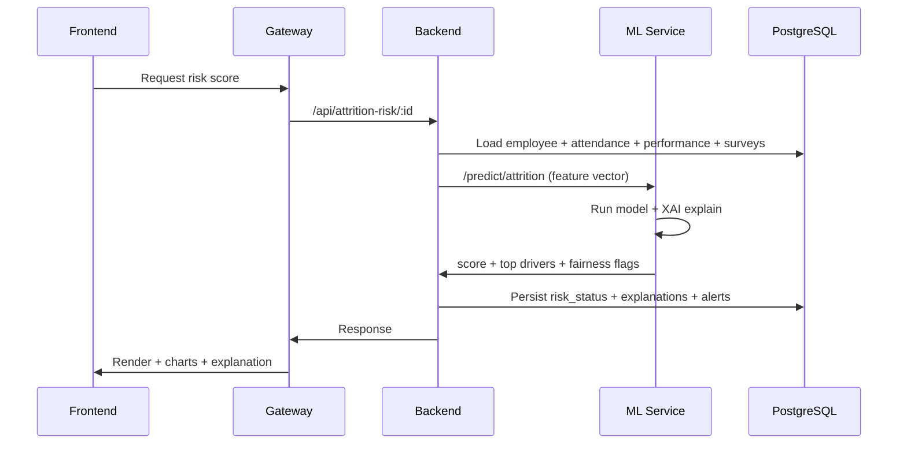

# 🏗️ Smart Performance System — Architecture

> **الهدف**: منصة ذكية لتحليل وإدارة الأداء والتقييم، التنبؤ بالدوران/الاستقالة، التوصية بالتدخلات والتدريب، ومراقبة العدالة الوظيفية (Fairness/Bias) مع دعم التفسير (XAI).

---

## 📌 فهرس المحتويات
1. [نظرة عامة](#نظرة-عامة)
2. [المستخدمون والأدوار](#المستخدمون-والأدوار)
3. [مبادئ التصميم المعماري](#مبادئ-التصميم-المعماري)
4. [نطاق النظام والتكامل](#نطاق-النظام-والتكامل)
5. [المعمارية عالية المستوى](#المعمارية-عالية-المستوى)
6. [مكونات النظام (Containers)](#مكونات-النظام-containers)
7. [معمارية الـ Backend (NestJS)](#معمارية-ال-backend-nestjs)
8. [معمارية الذكاء الاصطناعي (ML & XAI & Fairness)](#معمارية-الذكاء-الاصطناعي-ml--xai--fairness)
9. [معمارية البيانات](#معمارية-البيانات)
10. [معمارية الـ API والـ Gateway](#معمارية-ال-api-وال-gateway)
11. [الأمان والحوكمة](#الأمان-والحوكمة)
12. [النشر والتشغيل (Docker/K8s)](#النشر-والتشغيل-dockerk8s)
13. [المراقبة والرصد (Observability)](#المراقبة-والرصد-observability)
14. [التوسع والموثوقية (Scalability & Reliability)](#التوسع-والموثوقية-scalability--reliability)
15. [خارطة التطوير](#خارطة-التطوير)

---

## نظرة عامة

النظام مصمم ليعمل كـ **منصة ويب** (مع قابلية التوسع لتطبيق موبايل/PWA) تدير دورة “البيانات → التحليل → التنبؤ → التوصية → التقرير” بشكل شبه لحظي، وتُخرج لوحات معلومات وتقارير تنفيذية.

**المخرجات الأساسية:**
- مؤشرات الأداء (KPIs) الفردية والجماعية
- مخاطر الاستقالة/الدوران (Attrition/Turnover Risk)
- الاحتياجات التدريبية والمسارات الوظيفية المقترحة
- توصيات تدخلات (Interventions) للحفاظ على الكفاءات
- مراقبة العدالة الوظيفية وإظهار مؤشرات الإنصاف
- تفسيرات للنماذج (XAI) لزيادة الشفافية والثقة

---

## المستخدمون والأدوار

الأدوار الأساسية (وفق الوثيقة):
- **Employee (الموظف)**: تسجيل حضور/انصراف، متابعة أدائه، استلام تنبيهات وتقارير.
- **Manager (المدير)**: مراجعة الأداء، اعتماد الترقيات/الحوافز، اتخاذ قرارات بناءً على توصيات النظام.
- **HR Officer (مسؤول الموارد البشرية)**: تحليل المؤشرات، متابعة الغياب/المخاطر، إدارة التدخلات والتوصيات والسياسات.
- **Admin (المسؤول الإداري)**: إدارة الأدوار والصلاحيات، مراقبة الخدمات، إعدادات البنية التحتية واستمرارية المنصة.

> **التطبيق العملي داخل المستودع**: يتم تمثيل هذا عبر طبقة **IAM** (مستخدم/دور/صلاحيات) + Guards/Policies في الـ Backend، مع واجهات مختلفة في الـ Frontend حسب الدور.

---

## مبادئ التصميم المعماري

1. **Microservices / Modular**  
   التصميم الحالي مبني كمنظومة “خدمات/وحدات” مستقلة قدر الإمكان (Gateway + Backend + ML-Service + بنية دعم)، مع تنظيم داخلي للـ Backend بأسلوب طبقات/DDD لتسهيل الصيانة والتطوير.

2. **API-First + Contract-Driven**  
   كل واجهات الاستخدام تعتمد على Contract موحد عبر الـ Gateway (`/api/*`) مع Envelope ثابت للاستجابات.  
   > راجع: `CANONICAL_ROUTE_MAP.md` و `docs/DATA_CONTRACT.md`.

3. **Explainability (XAI) & Fairness by Design**  
   أي تنبؤ/توصية يجب أن يترافق مع تفسير مبسّط + قياسات عدالة يمكن عرضها داخل التقارير.

4. **Security & Privacy by Default**  
   RBAC/ABAC، تشفير أثناء النقل، سياسات احتفاظ بالبيانات، وسجلات تدقيق (Audit).

5. **Reliability + Fallbacks**  
   عند تعطل مصدر بيانات خارجي أو انقطاع اتصال، يتم تطبيق آليات بديلة (Fallback) وتسجيل الحدث.

---

## نطاق النظام والتكامل

### مصادر البيانات داخل المؤسسة
- بيانات الموظفين (Demographics + وظيفة/قسم/مؤهل)
- الأداء والتقييمات الدورية
- الحضور والانصراف والغياب والمخالفات
- الرضا الوظيفي/استبيانات
- الرواتب/الحوافز/الترقيات (إن توفرت أو عبر تكامل)
- التدخلات وخطط التطوير والتدريب

### التكاملات الخارجية (Integrations)
- **HRIS / ERP** عبر REST APIs
- أنظمة الحضور (بطاقة/بصمة/أجهزة)
- أدوات BI (Power BI / Tableau / Metabase) عبر تصدير CSV/Excel أو Data Views

---

## المعمارية عالية المستوى

### C4 — Context (المشهد العام)

```mermaid
flowchart LR
  Emp[Employee] -->|Web/PWA| UI
  Mgr[Manager] -->|Web| UI
  HRO[HR Officer] -->|Web| UI
  Adm[Admin] -->|Console| UI

  UI[Frontend (React)] --> GW[API Gateway (Nginx)]
  GW --> BE[Backend API (NestJS)]
  GW --> ML[ML Service (FastAPI)]

  BE --> PG[(PostgreSQL)]
  BE --> R[(Redis)]
  BE --> MQ[(RabbitMQ)]
  BE --> FS[(Object Storage / Reports)]
  ML --> PG
  ML --> FS

  HRIS[HRIS / ERP] -->|REST/ETL| BE
  Att[Attendance Devices] -->|API/Batch| BE
  BI[BI Tools] -->|Export/Views| BE
```

---

## مكونات النظام (Containers)

> **نقطة الدخول الموحدة** في التشغيل عبر Docker Compose هي: `gateway` على المنفذ **8080**.

### 1) API Gateway (Nginx)
- **الدور**: نقطة دخول واحدة، توجيه المسارات، ضغط Gzip، حدود رفع الملفات، وتحكم أساسي.
- **المسارات الأساسية**:
  - `/api/*` → Backend
  - `/api/ml/*` و `/ml/*` → ML Service
  - `/` → Frontend
  - `/ws` → WebSocket (إن وجد)

### 2) Frontend (React + TypeScript)
- واجهة ويب تفاعلية (لوحات + فلاتر + تقارير + تصدير)
- تصميم قابل للتدويل i18n (عربي/إنجليزي) ومهيأ للـ Responsive

### 3) Backend API (NestJS)
- إدارة المستخدمين، الصلاحيات، بيانات الموظفين، الأداء، التقارير، التكاملات
- ينسق مع ML Service لإجراء التنبؤات والتوصيات

### 4) ML Service (FastAPI)
- نقاط نهاية للتنبؤ (Attrition/Training/Performance) + تفسير (XAI)
- يمكن تشغيله متزامنًا عبر HTTP أو لا-متزامنًا عبر Queue عند كثافة الحمل

### 5) قواعد البيانات والبنية الداعمة
- **PostgreSQL**: قاعدة البيانات الرئيسية (Structured Data + JSONB عند الحاجة)
- **Redis**: Cache + Rate limiting + Sessions/Locks
- **RabbitMQ**: Jobs/Async Tasks (توليد تقارير، إعادة تدريب، تنبيهات مجمّعة…)
- **Volumes/Storage**: تخزين نماذج ML وملفات التقارير

> ملاحظة: الوثيقة تقترح استخدام MongoDB للبيانات غير المهيكلة. في هذا التنفيذ يمكن استخدام **PostgreSQL JSONB** كبديل عملي، أو إضافة MongoDB لاحقًا إذا زادت الحاجة للبيانات الوثائقية.

---

## معمارية الـ Backend (NestJS)

### تنظيم المجلدات (داخل `server/`)
النظام مطبق بأسلوب طبقات واضحة:

- `services/interfaces/` : Controllers + DTOs + Guards (Boundary)
- `services/application/` : Use-cases (Orchestration)
- `services/business/` : سياسات الأعمال (Policies) + تنسيق
- `services/domain/` : Entities/Value Objects + قواعد الدومين
- `services/rules/` : قواعد إضافية (Validation/Scoring rules)

### الوحدات (Domains)
يوصى أن تبقى هذه الوحدات **مستقلة** منطقياً حتى لو كانت داخل خدمة واحدة (Modular Monolith)، لتسهيل التفكيك إلى Microservices لاحقًا:

1. **Auth & IAM**
   - JWT/Refresh tokens
   - RBAC + (اختياري) ABAC لقرارات أكثر دقة
   - 2FA (مرحلة لاحقة/اختياري)

2. **Employee & Organization**
   - موظفون، أقسام، أدوار وظيفية، مهارات

3. **Performance**
   - إدخال/استيراد تقييمات
   - حساب KPIs وتخزين سجل الأداء الزمني

4. **Attrition / Turnover**
   - حساب معدلات الدوران
   - تشغيل تنبؤ المخاطر + حفظ “حالة الخطر” + أسباب/عوامل

5. **Training & Development**
   - توصيات تدريب
   - تتبع أثر التدخلات (تحسن/ثبات/تراجع)

6. **Fairness & Bias Monitoring**
   - مراقبة الإنصاف في التقييم/الترقية/التدريب
   - تقارير انحياز حسب الجنس/القسم/المسمى/… (حسب سياسات المؤسسة)

7. **Reports & Exports**
   - تقارير PDF/Excel/CSV
   - Views للتكامل مع BI
   - Scheduler للتقارير الدورية

8. **Notifications**
   - Alerts داخل النظام + (اختياري) Email/SMS/WhatsApp
   - إشعارات عند ارتفاع مخاطر الاستقالة أو تراجع الأداء أو مؤشرات تحيز

9. **Integrations**
   - Connectors لـ HRIS/ERP
   - Import/Export موحد + Validation + Mapping (راجع `docs/field-mapping.md`)

---

## معمارية الذكاء الاصطناعي (ML & XAI & Fairness)

### طبقتان: Training + Inference

1) **Inference (تشغيل التنبؤ)** — `ml-service/`
- واجهات FastAPI:
  - `POST /predict/attrition`
  - `POST /predict/training-needs`
  - `POST /predict/performance`
  - `POST /explain/*` (SHAP/LIME/…)
  - `POST /fairness/metrics`

- تخزين:
  - النتيجة + العوامل المؤثرة → جداول “حالة المخاطر” و “تفسيرات النتائج”
  - ملفات النماذج → Volume `ml-models`

2) **Training (التدريب وإدارة النماذج)** — `hr_ai_layer/` (اختياري/منفصل)
- تتبع التجارب (MLflow)
- إدارة البيانات/المعالجة/الهندسة الخصائص
- نشر نموذج معتمد إلى `ml-service` (Model Registry → Artifact)

### دورة حياة التنبؤ (مثال: Attrition)


### Fairness Metrics (أمثلة)
- Demographic Parity (فرق معدلات التوصية/الترقية)
- Equal Opportunity (فرق الحساسية بين المجموعات)
- Disparate Impact Ratio (مؤشر 80%)
> اختيار المقاييس يعتمد على سياسة المؤسسة والبيانات المتاحة، ويجب عرضها ضمن التقارير ولوحات المتابعة.

---

## معمارية البيانات

### قواعد البيانات
- **PostgreSQL (أساسي)**: البيانات المهيكلة وسجلات الأحداث/التقارير.
- **Optional Document Store (اختياري)**: MongoDB للبيانات غير المهيكلة (استبيانات خام، مرفقات، …) إن لزم.

### أهم الكيانات (مستقاة من تصميم الجداول في الوثيقة)
- Employees, Departments, Roles, Accounts
- Attendance, Violations
- Performance
- Recommendations
- TrainingPrograms, Skills
- Interventions
- RiskStatus (Attrition/Performance risk)
- Alerts/Notifications
- ReportsOutput (CSV/Excel/PDF)
- Explanations (XAI)
- FairnessAnalysis
- TurnoverReports, Resignations
- Surveys
- DataGovernance, Policies

### تصنيف البيانات (Data Classification)
- ديموغرافية، أداء، حضور، رضا، مالية/وظيفية، مخاطر، تدريب/تطوير، عدالة/حوكمة
- عناصر إضافية: جودة البيانات، التحليل الزمني، التكاليف، التكامل، التفسير

---

## معمارية الـ API والـ Gateway

### Entry Point
- `http://<host>:8080/`

### مسارات موحدة
- Frontend calls: `/api/*`
- ML calls (من الواجهة): `/api/ml/*` (يتم إعادة كتابتها في Nginx إلى ML)

### Versioning
- داخلياً نوصي بتثبيت نسخ المسارات الحساسة مثل:
  - `/api/console/v1/*`
  - `/api/public/v1/*`

### Response Envelope (موحد)
```json
{
  "success": true,
  "message": "OK",
  "data": {},
  "error": null,
  "timestamp": "2026-03-18T12:00:00Z"
}
```

### التوثيق
- Backend: Swagger/OpenAPI (يُعرض عادة على `/api/docs`)
- ML: Swagger UI (FastAPI)

---

## الأمان والحوكمة

### IAM
- RBAC كأساس (Employee/Manager/HR/Admin)
- ABAC (اختياري) لتحديد الوصول حسب: القسم، مستوى السرية، موقع العمل، … إلخ

### حماية البيانات
- تشفير أثناء النقل: TLS (على مستوى الـ Gateway في الإنتاج)
- تشفير أثناء التخزين: AES-256 (للحقلّيات الحساسة أو على مستوى القرص)
- Password hashing: bcrypt/argon2

### التدقيق والامتثال
- Audit Logs لكل عملية حرجة (تعديل تقييم، قرار ترقية، تغيير صلاحيات، تصدير بيانات)
- Data Retention وفق جدول “حوكمة البيانات”
- Masking للبيانات الحساسة في بيئات الاختبار

---

## النشر والتشغيل (Docker/K8s)

### Docker Compose (Dev/Test)
الخدمات الأساسية:
- `gateway` : 8080
- `backend` : 3000
- `ml-service` : 8000
- `postgres` : 5433 → 5432
- `redis` : 6379
- `rabbitmq` : 5672 + لوحة الإدارة 15672

### Kubernetes (Production-ready)
- يوجد مجلدات `kubernetes/` و `bridge/` و `infrastructure/` لدعم النشر
- يوصى بـ:
  - HPA للـ backend و ml-service
  - NetworkPolicies
  - Secrets Management
  - Ingress Controller (أو استخدام Gateway نفسه خلف Load Balancer)

### CI/CD
- Build → Test → Security Scan → Deploy
- نشر تدريجي (Rolling) مع Healthchecks وإمكانية Rollback

---

## المراقبة والرصد (Observability)

- **Healthchecks** لجميع الخدمات (`/api/health` …)
- **Metrics**: Prometheus + Grafana (اختياري/حسب الإعداد)
- **Logs**: تجميع مركزي (Loki/ELK) + Correlation ID
- **Tracing**: OpenTelemetry (مرحلة لاحقة) لتتبع الطلب من Gateway حتى ML

---

## التوسع والموثوقية (Scalability & Reliability)

### التوسع
- خدمات Stateless (Gateway/Backend/ML) قابلة للتكرار أفقيًا
- Redis لتخفيف الضغط عن DB
- Queue لعزل الأحمال الثقيلة (توليد تقارير، batch scoring، …)

### الموثوقية وFallbacks
- عند فشل التكامل مع HRIS/ERP:
  - استخدام آخر Snapshot صالح
  - وضع مصدر البيانات في حالة “Degraded”
  - إشعار Admin/HR
- عند تعذر ML:
  - إرجاع آخر تنبؤ محفوظ مع “Staleness indicator”
  - أو تشغيل نموذج أبسط Rule-based كخطة بديلة (اختياري)

---

## خارطة التطوير

1. **Mobile App / PWA**: إضافة قنوات Mobile مع نفس Contract
2. **MongoDB (اختياري)**: عند ارتفاع حجم البيانات غير المهيكلة
3. **BI Native Connectors**: Metabase/PowerBI مباشرة عبر Views/Read-replicas
4. **Advanced Fairness**: سياسات مؤسسة + Thresholds + Auto-remediation suggestions
5. **LLM Layer (اختياري)**: تلخيص تقارير الأداء وشرح مبسّط للمخرجات (مع حوكمة صارمة للخصوصية)

---

> آخر تحديث: 2026-03-18
